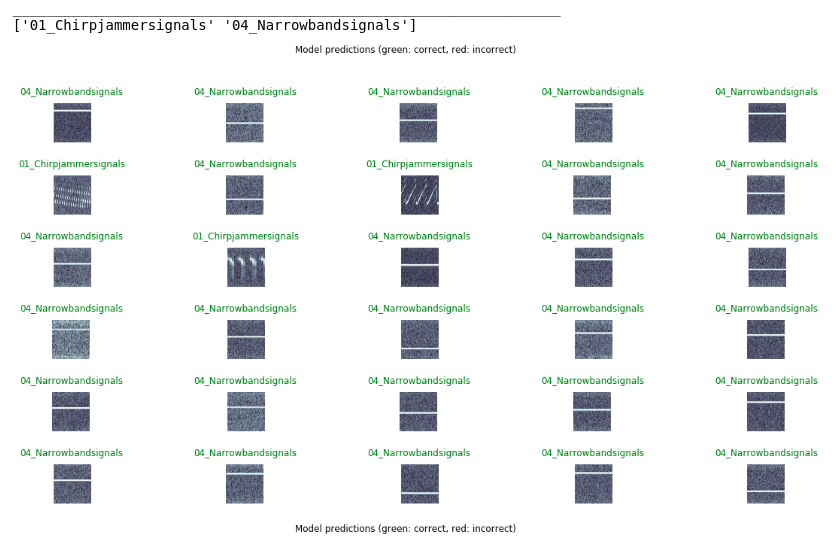

# Jammer Classification

This project aims to provide a setup for Signal Classification/Detection of different Signal Spectogram signatures!

### Introduction

This project was started as an internal project from within Airbus Defence and Space. The aim of the project was to verify the feasibility of classifying different Jammer signals using CNN. The solution in this repository is currently tested only on the real world Jammer signals processed using FFT transformations. The Data can't be provided because of the privacy policy and data export regulations. However, this code is free to be tested on any kind of Signals.

You need to preprocess, the signals to generate an image representation of it either using FFT or MFCC or any other signal pre-processing algorithms. <b> Librosa </b>, --> https://librosa.github.io/librosa/ provides a nice environment to do signal processing with python.


### Setup Instructions:
#### 1. Requirements

To reproduce the results from this repository, it is recommended to use virtual python environment and python version 3.7. Tensorflow version 2.0rc was used to build the models. Tensorflow_hub models were used for fine-tuning of the models.

Follow these simple steps to setup the dependencies:

```shell
git clone https://github.com/AkhilSinghRana/SignalClassification-UsingCNNs.git

cd SignalClassification-UsingCNNs

virtualenv env_name -p python3

source env_name/bin/activate #for linux


pip install -e .

 ```

Note*- The above code will setup all the required dependencies for you. Tested only on Linux


You are now ready to open the jupyter notebook for training and testing the pre trained models


#### 2. Train on your own Dataset:

Instructions for training on your own Dataset is shown in the notebook below. You have 2 options, you can either train a CNN model from scratch if you have enough training data per class! If not the repository provides you to use Pre-Trained Feature extractors for extractind complex features, and building a classifier head on top of this extracted features. You also have an option for fine-tuning the feature extractor. The feature extractors are downloaded from tensorflow-hub --> https://www.tensorflow.org/hub

Jupyter Notebook:

``` jupyter notebook train_models.ipynb  ```
 
Running from a Terminal:

``` python main.py --help ```

        Options:
         mode = train/usePreTrain
         pre_train_model_name = inception_v3/anytfhub_module 
         input_dir = directory containing train, test and val folders
 
  
#### 2. Testing/Loading model from checkpoint:

We also provide you with a notebook which shows how you can load the model weights from previous training for testing your test dataset, with new learnt classes.

Jupyter Notebook:

``` jupyter notebook test_models.ipynb ```

Running from a Terminal:

``` python main.py --help ```

        Options:
         mode = train/usePreTrain
         pre_train_model_name = inception_v3/anytfhub_module 
         input_dir = directory containing train, test and val folders
 


### Results

Since I did not had enough training data per class, I found using pre-trained model as a feature extractor works really good for me.

Results for testing on 2 different classes (ChirpJammer and NarrowBandSignal) is shown in fig below  

Results for testing on 4 different classes (ChirpJammer, NarrowBandSignal, ChirpUnknown, Interference Signals) is shown in the fig below  

You can also visualize the training curve(shown in train_models notebook).  

